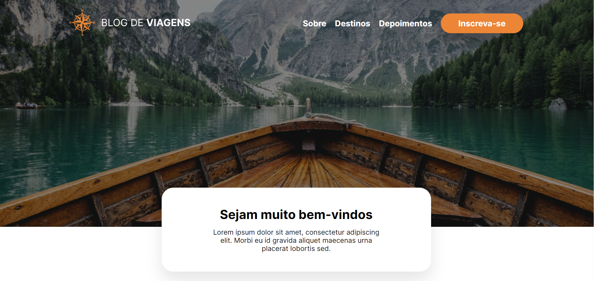

# Blog de viagens - Home

Esse é um projeto para blog de viagens moderno, design limpo e com traços modernos, posts em cards, bordas arredondadas e muito mais. Além disso possui a ideia de mobile first com um bom design responsivo.

## 📋 Funcionalidades

 - Menu responsivo com hamburguer animado
 - Seções modernas com cards
 - Design responsivo
 - Newsletter com um design inovador

## ✅ Tecnologias utilizadas

Para a construção utilizei o SASS com a sintaxe SCSS, ele facilitou bastante na criação do estilo pude reutilizar bastante código com os `mixins` e `include`. Também foi bom para estudar a questão da herança de seletores.

Para a responsividade utilizei bastante o `flexbox` e suas propriedades, principalmente a `flex-wrap` ela permite que os itens quebrem de acordo com a tela.

Utilizei o Javascript orientado a objetos e recursos DOM para criar o menu responsivo animado. 

E para aumentar a perfomance usei o comando de terminal `sass assets/scss/style.scss:assets/css/style.css --style compressed` para poder minificar o arquivo style.css e deixar mais rápida a leitura pelo navegador.

**Techs:** HTML, CSS, SASS, Javascript

## Menu responsivo

## Responsividade

## 🚀 Sobre
Olá eu sou Álvaro Emanuel, desenvolvedor front-end...

Entre em contato: alvarodiasribeiro16@gmail.com

## 🔗 Links

